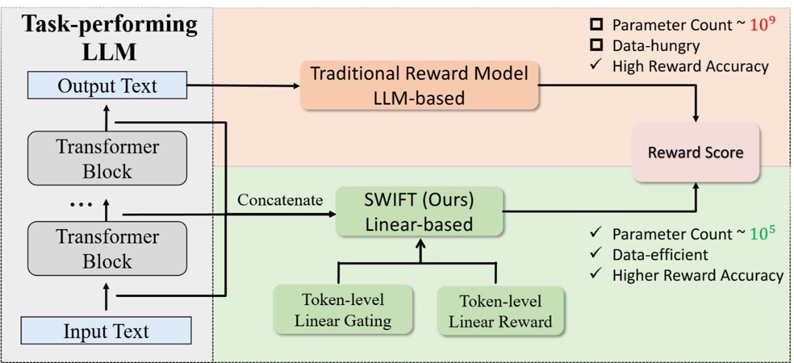
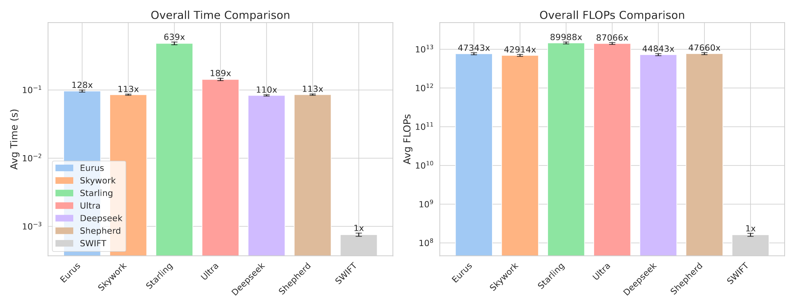

# SWIFT: Mining Intrinsic Rewards from LLM Hidden States for Efficient Best-of-N Sampling

🔗Full paper: [https://arxiv.org/abs/2505.20286](https://arxiv.org/abs/2505.12225)

This repository is the official resource for the paper **"Mining Intrinsic Rewards from LLM Hidden States for Efficient Best-of-N Sampling"**. We introduce **SWIFT** (Simple Weighted Intrinsic Feedback Technique), a novel, lightweight, and highly efficient reward modeling approach for Large Language Models (LLMs).

---

## Abstract

Enhancing Large Language Model (LLM)’s performance with best-of-N sampling is effective but often computationally prohibitive due to massive, data-hungry text-based reward models. By changing the data source from text to hidden states, we introduce **SWIFT**, a novel, lightweight technique that leverages the rich information embedded in LLM hidden states. SWIFT operates on a token-level and consists of only linear layers, resulting in a model with **fewer than 0.005% of the parameters** of traditional reward models. Extensive experiments show that SWIFT consistently outperforms baselines, requires only a few samples for training, and demonstrates significant efficiency improvements in speed and computation.

## The Problem: Limitations of Conventional Reward Models

Best-of-N sampling relies on a reward model (RM) to select the best response from a set of candidates. However, conventional RMs are:

-   **Massive:** They are often fine-tuned LLMs themselves, with billions of parameters (e.g., 7B, 13B).
-   **Costly:** Training and inference consume substantial computational resources (GPU time and memory).
-   **Data-Hungry:** They require vast, high-quality preference datasets for training.

These limitations create a significant barrier to their practical application and research.

## Our Solution: SWIFT

SWIFT bypasses these issues by mining intrinsic signals directly from the task-performing LLM's internal hidden states, rather than its generated text.


*Figure 1: A high-level comparison between a traditional, LLM-based reward model and our lightweight SWIFT approach.*

The workflow is simple and elegant:
1.  For each generated token, we extract and concatenate its hidden states from all transformer layers.
2.  A simple **linear model** learns a token-level reward score and a gating value (importance weight).
3.  The final reward for a response is the weighted average of all its token-level rewards.

This "intrinsic feedback" approach captures the model's internal confidence and reasoning quality far more efficiently than analyzing the final text output.

## Key Features

-   🚀 **Extreme Efficiency:**
    -   **Parameter Count:** Less than **0.005%** of baseline models (e.g., ~300k for SWIFT vs. 7B+ for others).
    -   **Speed & FLOPs:** Orders of magnitude faster and computationally cheaper than traditional RMs.

-   💪 **Superior Performance:**
    -   Consistently **outperforms** large-scale, open-source reward models like Eurus-7B and Ultra-13B across various benchmarks (MATH, GSM8K, etc.).

-   📊 **Data-Efficient:**
    -   Achieves strong performance with as few as **6,000 training samples**, demonstrating remarkable scalability with more data.

-   🔌 **Highly Flexible:**
    -   Can be trained on **logits-only** for closed-source models where hidden states are inaccessible.
    -   Can be **combined** with external reward models to achieve further performance gains.

## Results

SWIFT's effectiveness is demonstrated across multiple datasets and base models.

### Best-of-N Accuracy (on MATH Dataset)

SWIFT consistently achieves the highest accuracy compared to much larger baseline models.

| Reward Model            | Llama-3.2-3B (@64) | Llama-3.1-8B (@64) | Ministral-8B (@64) | Avg. (from paper) |
| ----------------------- | ------------------ | ------------------ | ------------------ | ----------------- |
| Eurus-7B                | 46.8               | 52.2               | 55.0               | 51.0              |
| Skywork-Llama3.1-8B     | 48.8               | 53.4               | 61.6               | 52.9              |
| Starling-7B             | 39.8               | 49.0               | 47.0               | 46.7              |
| Ultra-13B               | 44.4               | 50.4               | 54.0               | 50.1              |
| RLHFlow-8B-Deepseek     | 47.6               | 49.8               | 57.8               | 51.1              |
| Math-Shepherd-7B        | 43.6               | 49.0               | 54.8               | 49.8              |
| **SWIFT (ours)**        | **53.6**           | **62.6**           | **62.8**           | **57.5**          |

### Efficiency Comparison

SWIFT provides a massive reduction in computational overhead.


*Figure 2: Average time and FLOPs per sample. SWIFT is orders of magnitude more efficient.*

## 💻 Code Release

The repository will be updated with the full implementation and training scripts after publication. We are committed to making our work fully reproducible.

**In the meantime, if you have an urgent need for the code or have specific questions about implementation, please feel free to reach out to the author Jizhou Guo.**

## Citation

If you find our work useful in your research, please consider citing our paper:

```bibtex
@misc{guo2025mining,
      title={Mining Intrinsic Rewards from LLM Hidden States for Efficient Best-of-N Sampling}, 
      author={Jizhou Guo and Zhaomin Wu and Hanchen Yang and Philip S. Yu},
      year={2025},
      eprint={2505.12225},
      archivePrefix={arXiv},
      primaryClass={cs.LG},
      url={https://arxiv.org/abs/2505.12225}, 
}
```